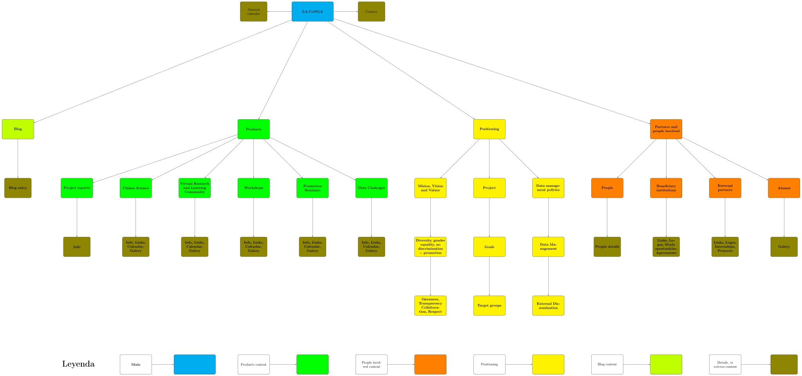
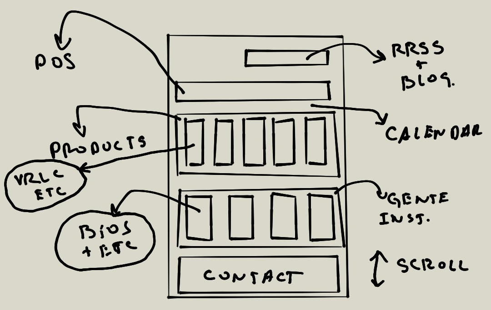
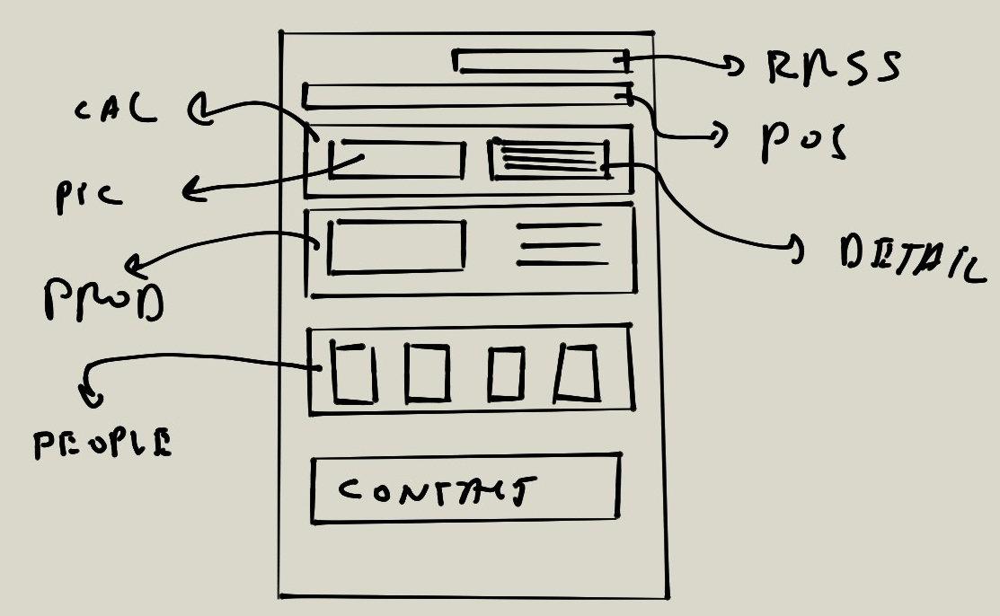
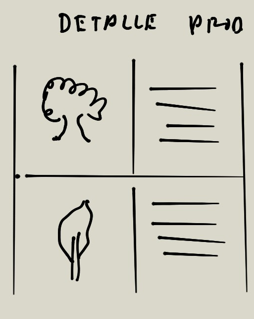

# LA-CoNGA Physics y su plan de comunicación
## Misión, visión y valores (MVV).
* Enlace actualizado: https://github.com/LA-CoNGA/WP5-Dissemination/blob/master/CommunicationPlan/Mision_vision_valores.md
* Estado de la discusión a lo interno del consorcio. Minutas: https://github.com/LA-CoNGA/InformationMeetings/blob/master/WP5_Meetings/20200501_WP5_mision_vision_valores_CoC_01_minuta.md

Otros docs: 
* Inglés 20200501: https://github.com/LA-CoNGA/InformationMeetings/blob/master/WP5_Meetings/20200501_CR-RC_LA-CoNGA_Physics_mission_and_vision.pdf
* Inglés comentado: https://docs.google.com/document/d/1TTfpbJaMWmgEhHv74FAuqRBu_daEWE1vz2E6ivrPzzQ/edit#
* Español: https://docs.google.com/document/d/1rHp_VV6J02UikkeUYsU1tdHISnzASKfjwNBDPpERxrk/edit
### Misión
Nuestra misión es crear una Comunidad Latinoamericana y Europea de Investigación y Aprendizaje de Física Avanzada para desarrollar capacidades, apoyando la modernización del sistema de educación superior y promoviendo valores de colaboración, educación e investigación abierta en universidades y organismos de investigación de Colombia, Ecuador, Perú y Venezuela.
### Visión
Al terminar el proyecto de la LA-CoNGA nos imaginamos lo siguiente:
En LA-CoNGA Physics construimos y cultivamos una red sostenible, dinámica, interconectada y diversa de investigadores latinoamericanos y europeos en física avanzada, con estrechos lazos con el sector productivo, que lidera el desarrollo de la ciencia y la tecnología en la región. Juntos contribuimos a la modernización, accesibilidad e internacionalización de los sistemas de educación superiores de la región. Nuestra comunidad es una referencia en el contenido curricular, las metodologías educativas utilizadas, e inspira la creación de otras comunidades similares.
### Valores
Estamos comprometidos con la excelencia, la apertura y la transparencia en nuestras actividades educativas y de investigación. Colaboramos. Nos comunicamos con palabras, acciones e imágenes que inspiran grandeza, y evitamos las que puedan incomodar a los demás. Fomentamos las discusiones animadas y constructivas. Nos tratamos unos a otros con respeto y consideración.  Acogemos y asesoramos a los miembros nuevos. Fomentamos las ideas novedosas, el debate constructivo. Apoyamos el diálogo entre la teoría y la práctica, entre la academia y la sociedad. Valoramos nuestros orígenes, talentos y experiencias diversas. Siempre estamos abiertos a sugerencias sobre cómo hacerlo mejor.
## Avances en mensaje de diversidad y Código de Conducta (CoC)
### Diversidad:
* Avances en discusiones están aquí: https://github.com/LA-CoNGA/InformationMeetings/blob/master/WP5_Meetings/20200429_WP5_diversity_minuta.md

* Documentos: https://github.com/LA-CoNGA/InformationMeetings/blob/master/WP5_Meetings/20200429_WP5_plus_diversity_meeting_slides.pdf
* Papel de trabajo: 
    * https://github.com/LA-CoNGA/InformationMeetings/blob/master/WP5_Meetings/20200401_WP5_meeting_LA-CoNGA_Physics_Tips_Diversity_Inclusion.pdf
    * https://docs.google.com/document/d/1jnORz6ftDo5R6axUWypbDfeUHH-LFC9gRGfJUNXxEiQ/edit
### CoC:
* Avances en discusiones están aquí: https://github.com/LA-CoNGA/InformationMeetings/blob/master/WP5_Meetings/20200501_WP5_mision_vision_valores_CoC_01_minuta.md

* El papel de trabajo inicial está en el mismo documento MVV: https://github.com/LA-CoNGA/InformationMeetings/blob/master/WP5_Meetings/20200501_CR-RC_LA-CoNGA_Physics_mission_and_vision.pdf
## Target groups
Hemos identificado 4 grupos hacia los que queremos desarrollar una estrategia de comunicación. Discusión aquí:
* https://github.com/LA-CoNGA/InformationMeetings/blob/master/WP5_Meetings/20200401_minuta_WP5.md
* https://github.com/LA-CoNGA/InformationMeetings/blob/master/WP5_Meetings/20200401_WP5_meeting_slides.pdf
* Target groups
    * TG 0: Interno (no relevante para el plan de comunicación)
    * TG1: Estudiantes candidatos a ser reclutados (con la finalidad de acercarlos al proyecto) 
    * TG2: Colegas científicos de áreas cercanas, relacionadas y que puedan compartir interés (como protagonistas de la posible replicación de la metodología LA-CoNGA en otras disciplinas)
    * TG3: Público general (divulgación y apropiación científica)
    * TG4: Instituciones: Universidades, Socios, Instituciones de financiamiento (con la finalidad de promover estrategias de sostenibilidad mediante la apropiación del proyecto desde las instituciones) 
## Clasificación de la información a ser difundida
Hemos dividido la información en tres categorías. Más información aquí: https://github.com/LA-CoNGA/InformationMeetings/blob/master/WP5_Meetings/20200422_WP5_Politica-Comunicacional_minuta.md
1. Divulgación de información sobre actividades concretas.
2. Políticas derivadas de nuestro posicionamiento (misión, visión y valores). Es evidente que estos elementos deben guíar nuestro modo de actuar y hablar. Además, queremos ser difusores de un mensaje explícito sobre nuestro compromiso.
3. Personas
### Actividades
* Website. TG: 1,2,3 y 4
* Multidisciplinary outreach events. TG: 1 y 2  ← Seminarios de lanzamiento están aquí
* Avances aquí:
* Data challenges. TG: 1 y 2
* Citizen science. TG: 1,2,3 y 4
    * Avances aquí: https://github.com/LA-CoNGA/InformationMeetings/blob/master/WP5_Meetings/20200427_WP5_CS_01_minuta.md
    * https://github.com/LA-CoNGA/InformationMeetings/blob/master/WP5_Meetings/20200427_WP5_CS_01_meeting_slides.pdf
* Summer schools. TG 1
### Políticas
* +MVV+CoC
* Gender equality (y diversidad) 
* Data Management Protection Plan
* Internal dissemination
* External consortium results dissemination
* Double Master Degrees in HEP
### Personas
* Representantes de las organizaciones
* Las organizaciones
* Los socios externos
* Los alumnos
## Opiniones y recomendaciones sobre la web
* Web actual: http://laconga.redclara.net/

A solicitud de la coordinación se hicieron esquemas y observaciones sobre la estructura del sitio web y la organización de la información.

* El sitio debe integrar de forma organizada la información

* Propuesta para vistas todo-en-uno (toda la información relevante debe estar disponible en una sola pantalla)

